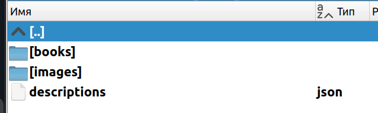
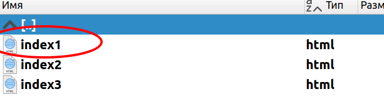

# online_book_library

## Описание проекта

Проект представляет собой статический генератор веб-сайтов на основе данных книг из файла json файла.
Книги ранее были скачаны с сайта www.tululu.org с помощью парсера https://github.com/zatomis/dev-parsing-online-library2.
Для генерации используется шаблон template.html и Jinja2 для рендеринга страниц книги.
Проект включает автоматическую перезагрузку с помощью Livereload, что позволяет мгновенно обновлять сайт при изменении данных.

- Скачайте код с GitHub.
- Python3 версии должен быть установлен в вашей системе, и установлены все зависимости
- Установите зависимости командой `pip install -r requirements.txt`
- Создайте файл окружения .env и пропишите в него свои данные.
- Запустите скрипт

```bash
pip install -r requirements.txt
```

## Запуск
Запуск скрипта производится с дополнительным параметром --dest_folder ИмяКаталога, это папка, содержащая файл описаний json и каталоги с данными, по примеру


Ниже приведен пример запуска скрипта, с папкой Genaral
```bash
$ python3 render_website.py --dest_folder General 
```

После запуска и работы скрипта, в том же каталоге что и скрипт будет создана папка pages, в которой будут файлы index1.html ... indexN.html
Проверить правильность создания страниц можно будет открыть в любом браузере файл index1.html


Пример рабочего варианта представлен по ссылке ниже
https://zatomis.github.io/render_website_library/

## Цель проекта
- Код написан в образовательных целях на онлайн-курсе для веб-разработчиков [Devman](https://dvmn.org)
